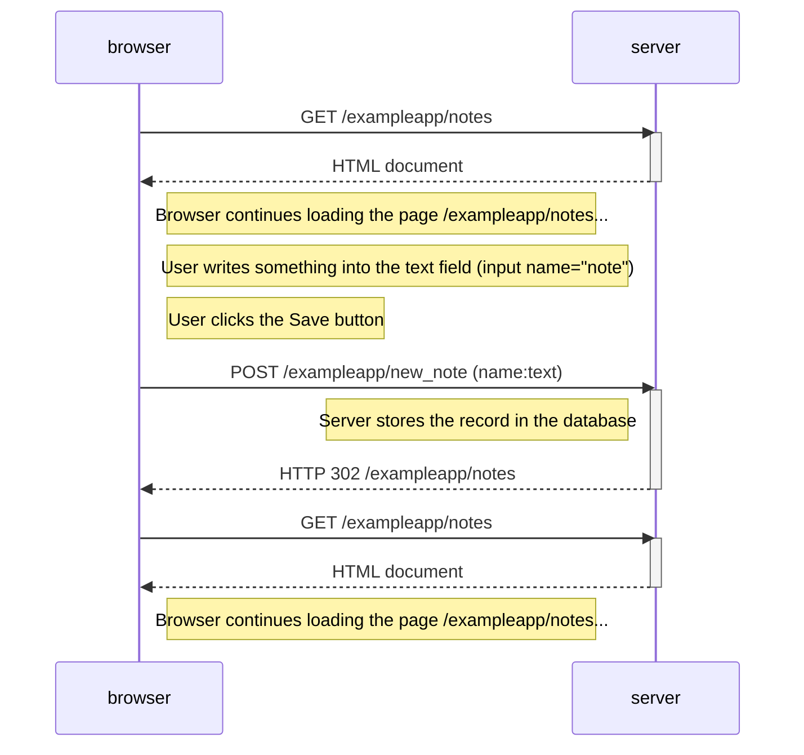
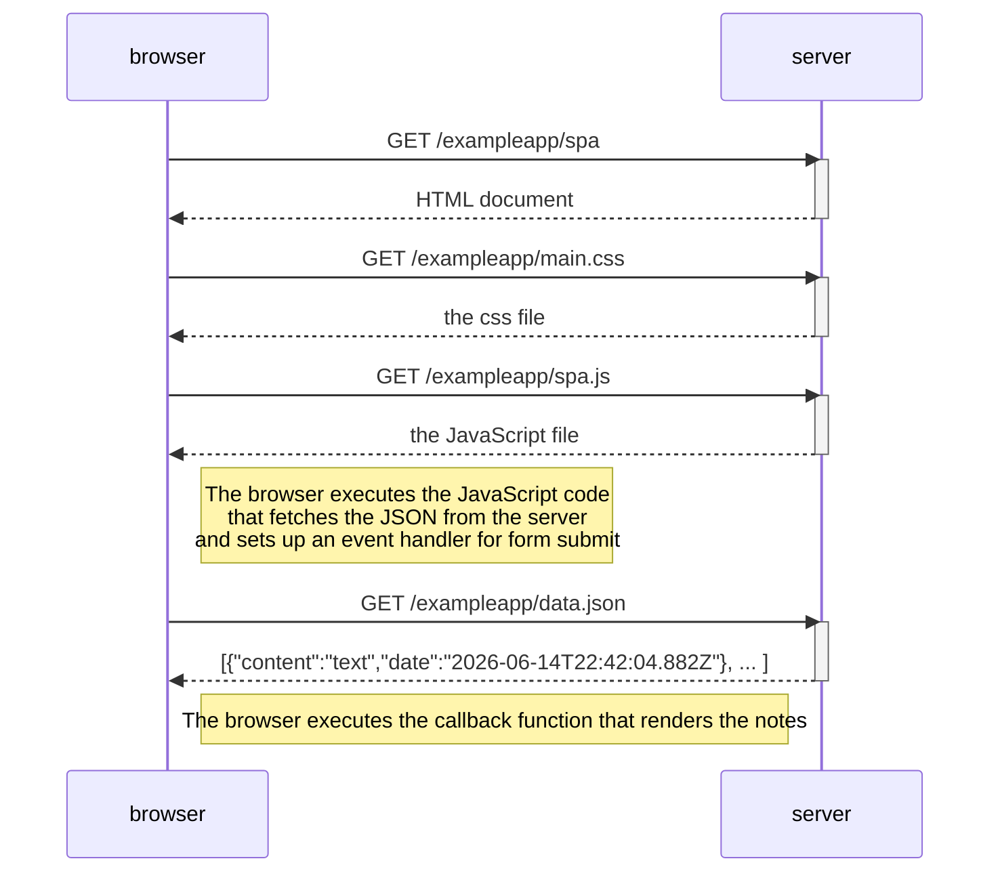
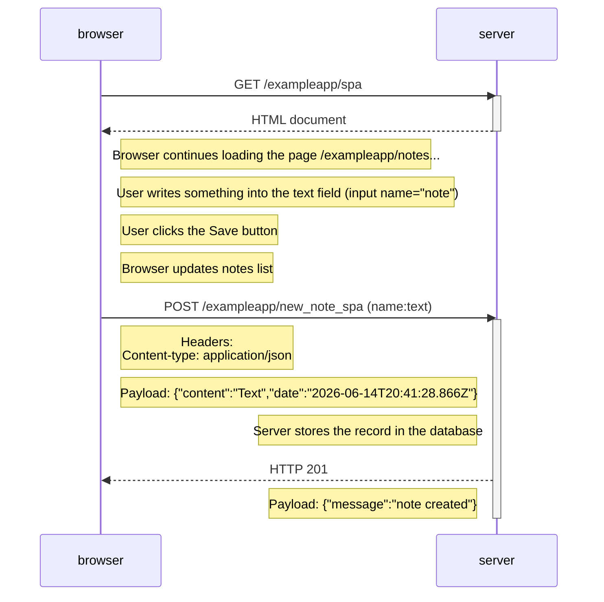

# Part 0

## Exercise 4.
### Diagram depicting the situation where the user creates a new note on the page /exampleapp/notes by writing something into the text field and clicking the Save button.

## Exercise 5.
### Diagram depicting the situation where the user goes to the single-page app version of the notes app.

## Exercise 6.
### Diagram depicting the situation where the user creates a new note using the single-page version of the app.

